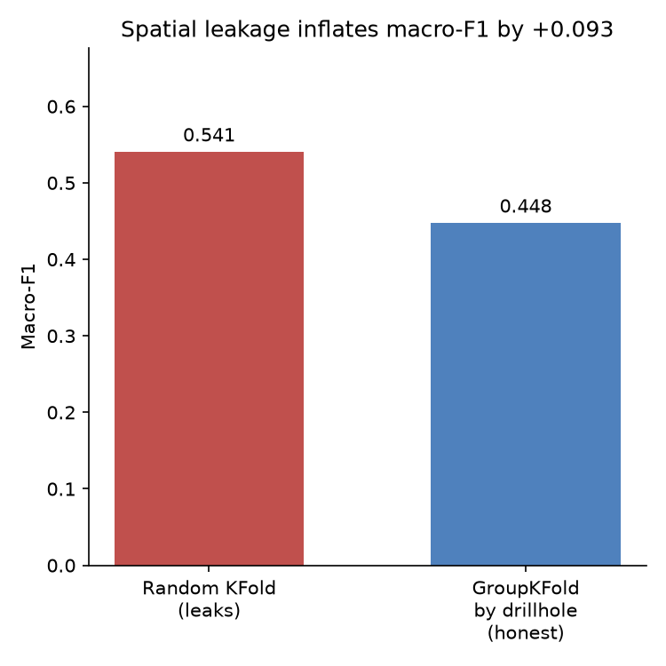
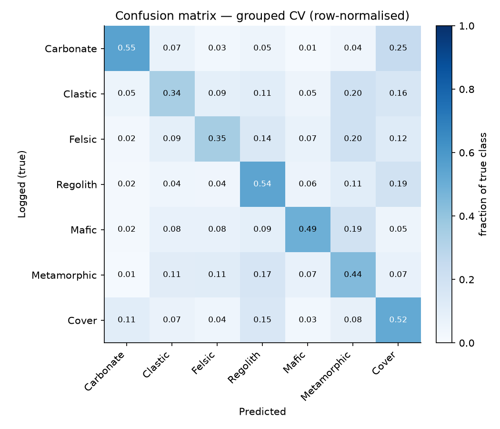
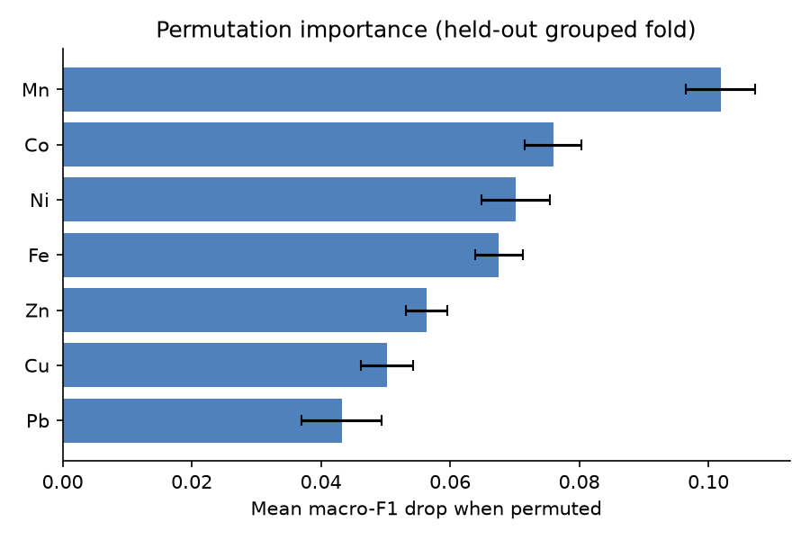
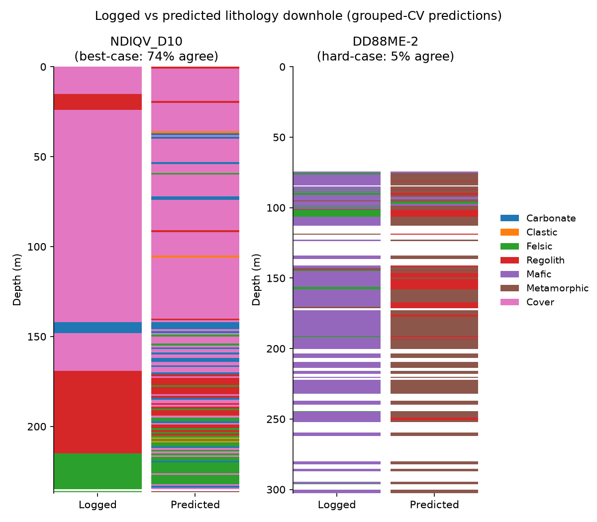

# Predicting lithology from drillhole geochemistry

Can a rock's assayed chemistry tell you what rock it is? This repository
trains a classifier to predict logged lithology from multi-element
geochemistry across ~3,400 South Australian drillholes, and — more
importantly — evaluates it *honestly*, the way spatially-clustered
geoscience data demands.

**Headline result:** a RandomForest reaches **macro-F1 0.448** across seven
lithology classes under drillhole-grouped cross-validation — six times the
majority-class floor (0.071). Evaluated with a naive random split instead, the
same model reports **0.541**. That 0.093 gap is not skill; it is spatial
leakage, and quantifying it is the point.

---

## 1. The problem

Geologists log lithology by eye as core comes out of the ground; labs assay
the same intervals for metals. Both are routine, but the log is subjective and
the assay is objective — so a natural question is how much of the rock-type
label is recoverable from chemistry alone. A model that does this reasonably
could flag mis-logged intervals, fill gaps where logging is missing, or bring
consistency to decades of multi-operator data.

This is a **work sample**, not a production system. The bar it sets for itself
is methodological honesty: real geoscience data is censored, compositional,
and spatially clustered, and each of those is handled explicitly rather than
ignored. The two things a geo-data scientist must get right that a generic
data scientist often misses — **compositional data** and **spatial leakage** —
are the spine of the write-up.

## 2. The data

- **Source:** [SARIG Data Package](https://catalog.sarig.sa.gov.au/) — the
  Geological Survey of South Australia's statewide export of SA Geodata.
- **Licence:** CC-BY 4.0 (see [LICENSE](LICENSE) for attribution).
- **Raw scale:** 65 million individual element analyses; ~3 million
  drillhole-linked samples.
- **Modelling set:** 20,024 samples across 3,424 drillholes that (a) carry a
  sample-level lithology label and (b) were assayed for all seven elements in
  the chosen suite. This small, committed table
  ([`data/processed/clean.parquet`](data/processed/clean.parquet), 620 KB)
  lets the figures regenerate without the 22 GB raw download.

Lithology is logged with 255 raw codes; these are consolidated to **seven
classes** by aggregating SARIG's own `ROCK_GROUP` taxonomy — a reproducible
mapping ([`data/lith_lookup.csv`](data/lith_lookup.csv) via
[`make_lookup.py`](src/lithoclass/make_lookup.py)), not hand-sorting. Classes:
Transported cover, In-situ regolith, Clastic sediment, Carbonate-chemical
sediment, Felsic-intermediate igneous, Mafic-ultramafic igneous, Metamorphic.

## 3. Method

`sarig_rs_chem` → parse censored values → harmonise units → per-sample pivot →
consolidate lithology → CLR transform → RandomForest → **GroupKFold by
drillhole**. Every data decision is dated and justified in
[DECISIONS.md](DECISIONS.md).

- **Censored assays.** ~14% of analyses are below detection ("<5"). These are
  substituted at half the detection limit with a censor flag retained per
  element — never silently dropped.
- **Element suite (Cu, Zn, Pb, Co, Ni, Fe, Mn).** Chosen over the strict
  "drop >40% missing" default because that would leave only four elements. Ag
  and Au were rejected as features despite good coverage: they are below
  detection in >50% of samples, so as features they largely encode a lab's
  detection limit, not rock chemistry.

> **Why CLR?** Geochemistry is *compositional* — the numbers are shares of a
> whole, so raising one element mathematically lowers the others. Modelling
> raw concentrations lets these closure effects manufacture correlations. The
> centred log-ratio (CLR) transform maps each sample to log-abundances
> relative to its own geometric mean, removing the spurious part. Raw
> concentrations are modelled only as a labelled baseline (see Results).

> **Why group by drillhole?** Samples from one hole are near-duplicates —
> same rock, centimetres apart. A random train/test split puts siblings on
> both sides, so the model is scored partly on memorisation. GroupKFold keeps
> every hole wholly in train or wholly in test, which is the only honest
> estimate of performance on a *new* hole. The gap between the two is the
> leakage chart below.

## 4. Results

Five-fold CV, pooled out-of-fold predictions, fixed seed. Full table in
[reports/results.md](reports/results.md).

| Model | Features | CV | Macro-F1 |
|---|---|---|---|
| Majority class | — | grouped | 0.071 |
| Logistic regression | CLR | grouped | 0.277 |
| **RandomForest** | **CLR** | **grouped** | **0.448** |
| RandomForest | log10 ppm | grouped | 0.478 |
| RandomForest | CLR | random (leakage demo) | 0.541 |

### The leakage chart



The identical model looks 21% better under random splitting purely because it
trains on samples from the holes it is tested on. Most tutorial write-ups
report the left bar. The honest number is the right one.

### What gets confused, and why it's geological



The mistakes fall exactly where different rock classes *share* a chemistry —
they are geological, not random:

- **Clastic sediment is the hardest class (F1 0.31).** A sandstone inherits
  the composition of whatever it eroded from — a sediment shed off a granite
  carries granitic chemistry — and a low-grade metasediment is the same
  protolith one metamorphic grade up.
- **Felsic igneous bleeds into Metamorphic.** Much of the "felsic" in these
  provinces is meta-igneous gneiss; granite versus felsic gneiss is a
  distinction of metamorphic grade, not composition — invisible to chemistry.
- **The flagship confusion: mafic ↔ metamorphic.** An amphibolite *is*
  metamorphosed basalt — identical magmatic chemistry, different fabric. The
  lookup (correctly) files amphibolite under Metamorphic and basalt under
  Mafic, so the two are chemically inseparable. In the hard-case hole below,
  logged mafic is predicted almost entirely metamorphic — a systematic flip,
  not noise. Geochemistry sees protolith, not metamorphic history.
- **Carbonate → cover is the single largest off-diagonal (25%)**, for two
  compounding reasons: carbonate rocks are barren in the base metals we
  measure and read as "low everything," and much South Australian cover is
  calcareous — so a barren carbonate and a barren calcareous cover are nearly
  the same sample in a base-metal suite.

### What the model gets right



The strongest signal is the mafic one: mafic-ultramafic rocks are the
best-classified basement class (F1 0.46), and the permutation importances show
why — **Mn, Co, Ni and Fe**, the ferromagnesian elements, carry the most
information. The model has genuinely learned the transition-metal fingerprint
of mafic rocks. That same fingerprint is what makes metamorphosed mafics so
hard to separate — one chemical signature driving both the best success and
the flagship confusion.

### Downhole: logged vs predicted



Two holes, best-case and hard-case. On the left the model tracks a thick cover
sequence and its transitions; on the right it systematically calls a
mafic-logged hole metamorphic — the amphibolite problem, made visible.

### The honest baseline finding

The log10-of-concentration baseline (0.478) slightly **beat** CLR (0.448). CLR
remains the primary feature set because modelling raw concentrations is
methodologically indefensible even when it scores better — closure effects can
manufacture correlations. The likely reason CLR underperforms *here*: our
suite is all trace/transition metals with no rock-forming majors (Si, Al, Ca,
Mg), so absolute abundance carries real lithological signal (cover is
low-everything; mafics are metal-rich) that CLR's scale-invariance discards.
With a full major-element suite the ranking would likely flip. The finding is
reported, not buried — see [DECISIONS.md](DECISIONS.md).

## 5. Limitations

- **DL/2 substitution** is a pragmatic censoring choice, not a formal
  censored-data model; the flags are retained but not modelled as such.
- **Single dataset, single region** (South Australia); no claim of transfer.
- **Class imbalance** (6,673 cover vs 1,314 carbonate) is handled with
  balanced class weights and reported via per-class F1, not hidden behind
  accuracy.
- **Trace-element suite only.** No major elements, so carbonates and cover are
  chemically dim (see carbonate→cover above).
- **No spatial or boundary modelling** — each sample is classified
  independently; downhole context is not used.
- **Label noise.** The target is one geologist's field log; some "confusions"
  are the model disagreeing with a subjective call, which is not the same as
  being wrong.

## 6. Next steps

- Add a major-element subcomposition and re-test CLR vs raw on equal footing.
- Try a formal censored-data likelihood in place of DL/2.
- Exploit downhole continuity (sequence/interval context) rather than
  classifying samples independently.

## 7. Built with Claude Code

This repository was built with [Claude Code](https://claude.com/claude-code)
as the implementation partner, under a geologist's review at every phase gate.
The division of labour is the point, and it is auditable:

- **The agent** wrote all the code (loading, cleaning, CLR, models,
  evaluation, figures, tests), profiled the 22 GB extract, proposed the
  lithology mapping from SARIG's taxonomy, and drafted the decision log.
- **The geologist (Hugh)** made every geological judgement: choosing
  sample-level labels, the element suite, the class scheme, and — critically —
  the interpretation of the confusions in Section 4, which no model can
  generate.
- **What broke and got caught:** an initial Victorian dataset was profiled and
  rejected for too few labelled holes; the first strip log was per-sample
  confetti that oversold failure and was reworked to show honest best/hard
  cases; the CLR-vs-baseline result was surfaced rather than buried. The trail
  is in [DECISIONS.md](DECISIONS.md).

## Reproducing

```bash
git clone https://github.com/hughmccutcheon/Lithoclass.git
cd Lithoclass
python -m venv .venv && .venv/Scripts/pip install -r requirements.txt -e .
python -m pytest                 # tests
python -m lithoclass.evaluate    # results table -> reports/results.md
python -m lithoclass.make_figures  # figures/ -> four PNGs
```

The committed `clean.parquet` makes the above run without the raw download. To
rebuild from source, place the SARIG `sarig_rs_chem_exp.csv`,
`sarig_dh_litho_exp.csv` and `sarig_dh_details_exp.csv` in `data/raw/` and run
`python -m lithoclass.extract` then `python -m lithoclass.make_clean`.

*Data © Geological Survey of South Australia, CC-BY 4.0.*
